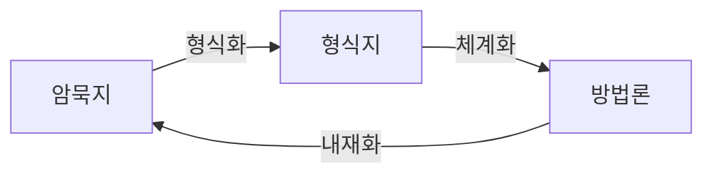

# 분석 방법론

- 대규모 조직, 기업 내에 데이터 분석이 정착하기 위해 **체계화한 절차와 방법**이 정리된 데이터 **분석 방법론의 수립**이 필수적
- 주어진 과제를 해결하기 위해 조직이 어떠한 절차로 작업 수행해 나갈 것인지 일련의 절차를 정의한 것
- **구성요소**
    - **절차 (Procedures)** : 작업 수행을 위한 절차
    - **방법 (Methods)** : 전문가에게 자문을 요구하거나 고객 요구사항 파악을 위한 대면조사 등
    - **도구와 기법 (Tools&Techniques)** : R, 파이썬 등 분석 수행 언어, 엑셀 같은 프로그램, 하둡·플럼 같은 분석 환경
    - **템플릿과 산출물 (Templates&Outputs)** : 어떤 작업 수행을 위해 문서 작성 시 참고 가능한 양식, 작업 종료 후 작성되는 문서 또는 프로그램

### 기업의 합리적 의사결정 방해 요소

- 고정 관념
- 편향된 생각
- 프레이밍 효과 : 동일한 사건이나 상황을 두고 개인의 판단이나 선택이 다른 현상

## 분석 방법론 생성 과정

[1과목 1-1 "데이터와 정보"](../../1.%20데이터%20이해/1.%20데이터의%20이해/1.%20데이터와%20정보.md) 내용 참고

- **암묵지** : 학습과 경험을 통해 개인에게 습득되어 있지만, 겉으로 드러나지 않는 상태의 지식.
    - 사회적으로 중요하지만 공유되기 어려움.
- **형식지** : 암묵지가 문서나 매뉴얼처럼 외부로 표출돼 여러 사람이 공유할 수 있는 지식.
    - 전달과 공유가 용이함.

### 암묵지와 형식지의 상호작용
- 암묵지 : 개인에게 **내면화**된 지식 → 조직의 지식으로 **공통화**
- 형식지 : 언어, 기호로 **표출화**된 지식 → 개인의 지식으로 **연결화**

## 방법론 적용 업무 특성에 따른 모델

### 폭포수 모델 (Waterfall Model)

- **단계를 순차적으로 진행하는 방법**
- 이전 단계가 완료되어야 다음 단계 진행 가능한 하향식 방향
- 문제 발견 시 이전 단계로 돌아가 피드백 과정이 수행

### 프로토타입 모델 (Prototype Model)

- 사용자 중심 개발 방법, **고객 요구를 완전히 이해하지 못한 경우** 적용
- **일부분을 우선 개발**하여 제공 후 요구 분석, 정당성 검정, 성능 평가 등을 통해 **개선 작업** 시행하는 모델

### 나선형 모델 (Spiral Model)

- 반복을 통해 점증적 개발, 단 프로토타입과 다르게 위험요소 사전 제거에 초점
- 처음 시도하는 프로젝트에 적용 용이하지만, 관리 체계가 효과적이지 않다면 복잡도 상승 → 프로젝트 진행이 어려워짐

### 계층적 프로세스 모델

- 일반적인 분석 방법론은 "계층적 프로세스 모델" 형태로 구성된다.
- 해당 모델은 최상위 계층인 몇 개의 단계로 구성되고, 하나의 단계는 여러 태스크로 구성되고, 하나의 태스크는 여러 개의 스텝으로 구성됨
- 스텝은 WBS (Work Breakdown Structure)의 워크패키지에 해당되며, "입력(Input) - 처리 및 도구(Process&Tool) - 출력(Output)"으로 구성된 단위 프로세스이다.

|구성        |내용                                                                                                                                         |산출물            |
|:----------:|:--------------------------------------------------------------------------------------------------------------------------------------------|:----------------:|
|단계(Phase) |최상위 계층, 프로세스 그룹을 통해 완성된 단계별 산출물 생성됨. 각 단계는 기준선이 설정되어 관리되어야 하고, 버전관리 등을 통하여 통제 필요|단계별 완료 보고서|
|태스크(Task)|단계를 구성하는 단위 활동으로, 물리적 또는 논리적 단위로 품질검토의 항목이 됨                                                                |보고서            |
|스텝(Step)  |WBS의 워크패키지, 입력-처리 및 도구-출력 으로 구성된 단위 프로세스                                                                           |보고서 구성요소   |