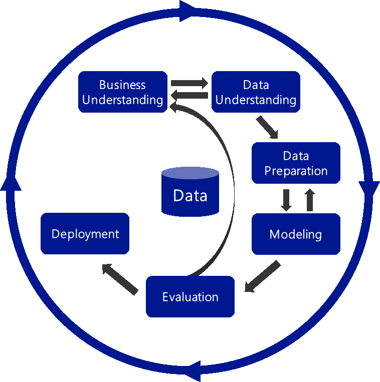

# KDD 분석 방법론

- KDD(Knowledge Discovery in Database)는 데이터로부터 통계적 패턴이나 지식을 찾기 위해 체계적으로 정리한 데이터 마이닝 프로세스
- 데이터 마이닝, 기계학습, 인공지능, 패턴인식, 데이터 시각화 등에서 응용가능한 구조를 갖고 있음

## KDD 분석 방법론 프로세스

1. **데이터셋 선택 (Selection)**
    - **비즈니스 도메인**에 대한 이해와 **프로젝트 목표 설정**이 필수
    - 분석에 필요한 데이터를 선택하여 **목표 데이터(Target Data)**를 생성
2. **데이터 전처리 (Preprocessing)**
    - 데이터셋 내의 **잡음(Noise), 이상치(Outlier), 결측치(Missing Value)** 식별 및 제거하거나 재가공하는 단계
    - **추가로 요구되는 데이터 셋**이 필요할 경우, 데이터 선택 단계 재실행
3. **데이터 변환 (Transformation)**
    - 데이터 분석 목적에 맞게 **변수 생성/선택 후 데이터 차원을 축소**하여 데이터 마이닝 할 수 있게 변환하는 단계
    - **학습용 데이터(Training Data)와 시험용 데이터(Test Data)**로 데이터를 분리
4. **데이터 마이닝 (Data Mining)**
    - 분석 목적에 맞는 **데이터 마이닝 기법을 선택**하고, 적절한 알고리즘 적용
    - 필요에 따라 **전처리와 변환 프로세스 추가로 진행**하여 최적의 결과 산출
5. **해석과 평가 (Interpretation/Evaluation)**
    - 데이터 마이닝 **결과에 대한 해석과 평가, 분석 목적과의 일치성**을 확인 및 평가
    - 발견한 **지식을 업무에 활용**하기 위한 방안 마련의 단계
    - 필요에 따라 이전 단계들(선택~마이닝)을 반복 수행

# CRISP-DM 분석 방법론

- 계층적 프로세스 모델로써, 5개의 업체들(Daimler-Chrysler, SPSS, NCR, Teradata, OHRA)가 주도하였다.
- 구조는 단계, 일반화 태스크, 세분화 태스크, 프로세스 실행 4개의 레벨로 구성되어 있다.
- 프로세스는 업무 이해, 데이터 이해, 데이터 준비, 모델링, 평가, 전개 6단계로 구성되어 있다.

## CRISP-DM의 4레벨 구조

단계(Phases) - 일반화 태스크(Generic Tasks) - 세분화 태스크(Specialized Tasks) - 프로세스 실행(Process Instances)

- 최상위 레벨은 여러 개의 단계로 구성되고, 각 단계는 여러 일반화 태스크를 포함한다.
- 일반화 태스크 : 데이터 마이닝의 단일 프로세스를 완전하게 수행하는 단위 (데이터 정제에 해당)
- 세분화 태스크 : 일반화 태스크의 구체적인 수행 레벨 (범주형 데이터 정제, 연속형 데이터 정제 등)
- 프로세스 실행 : 데이터 마이닝을 위한 구체적인 실행을 포함

## CRISP-DM 프로세스

- **단계별 피드백**을 통해 완성도를 높이는 방식으로 구성되어 있다.

1. **업무 이해 (Business Understanding)**
    - 비즈니스 관점에서 **목적과 요구사항을 이해**하는 단계
    - 도메인 지식을 **데이터 분석을 위한 문제 정의**로 변경하고 계획 수립하는 단계
    - 수행업무
        1. 업무 목적 파악
        2. 상황 파악
        3. 데이터 마이닝 목표 설정
        4. 프로젝트 계획 수립
2. **데이터 이해 (Data Understanding)**
    - **데이터 수집** 및 데이터 **속성을 이해**하는 단계
    - 데이터 품질에 대한 문제점을 식별하고, 숨겨진 **인사이트 발견**하는 단계
    - 수행업무
        1. 초기 데이터 수집
        2. 데이터 기술 분석
        3. 데이터 탐색
        4. 데이터 품질 확인
3. **데이터 준비 (Data Preparation)**
    - 수집된 데이터에서 분석 기법에 적합한 데이터를 편성하는 단계
    - 수행업무
        1. 분석용 데이터셋 선택
        2. 데이터 정제
        3. 분석용 데이터 셋 편성
        4. 데이터 통합
        5. 데이터 포맷팅
4. **모델링 (Modeling)**
    - 다양한 **모델링 기법과 알고리즘을 선택**하고, 파라미터를 **최적화**하는 단계
    - 데이터 셋이 추가로 필요할 경우, 데이터 준비 단계를 반복 수행 가능
    - 모델링 결과를 테스트용 데이터 셋으로 평가하여 과적합 문제(Overfitting) 확인
    - 수행업무
        1. 모델링 기법 선택
        2. 모델 테스트 계획 설계
        3. 모델 작성
        4. 모델 평가
5. **평가 (Evaluation)**
    - 모델링 결과가 **프로젝트 목적에 부합하는지 평가**하는 단계
    - 데이터 마이닝 결과를 최종적으로 수용 할 것인지 판단
    - 수행업무
        1. 분석결과 평가
        2. 모델링 과정
        3. 평가
        4. 모델 적용성 평가
6. **전개 (Deployment)**
    - 완성된 모델을 **실제 업무에 적용하기 위한 계획을 수립**하는 단계
    - 모니터링과 모델 **유지보수 계획** 마련
        - 비즈니스 도메인 특성, 입력 데이터 품질 편차, 생명주기(LifeCycle) 등 고려하여 상세한 전개 계획 필요
    - 프로젝트 종료 관련 프로세스 수행하여 마무리하는 단계
    - 수행업무
        1. 전개 계획 수립
        2. 모니터링과 유지보수 계획 수립
        3. 프로젝트 종료보고서 작성
        4. 프로젝트 리뷰

# KDD와 CRISP-DM 비교

- (KDD) 데이터셋 선택 中 비즈니스 이해 = (CRISP-DM) 업무 이해
- (KDD) 데이터셋 선택 + 데이터 전처리 = (CRISP-DM) 데이터의 이해
- (KDD) 데이터 변환 = (CRISP-DM) 데이터 준비
- (KDD) 데이터 마이닝 = (CRISP-DM) 모델링
- (KDD) 해석과 평가 = (CRISP-DM) 평가
- (KDD) 해석과 평가 中 지식을 업무에 활용하기 위한 방안 마련 = (CRISP-DM) 전개