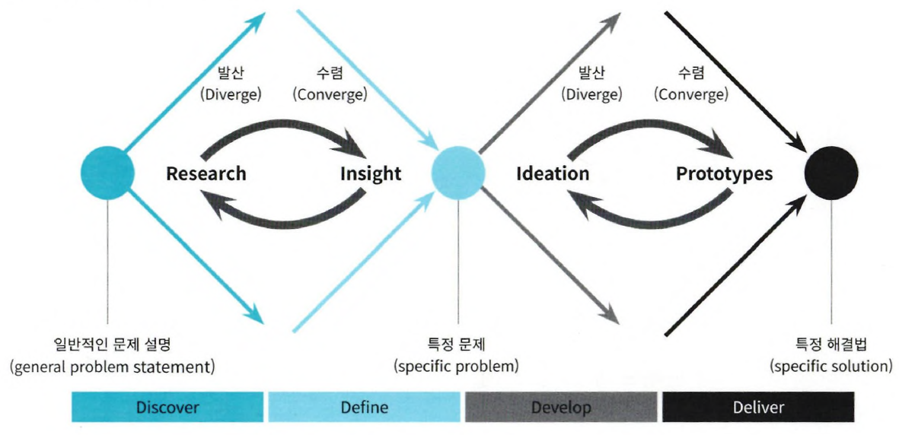
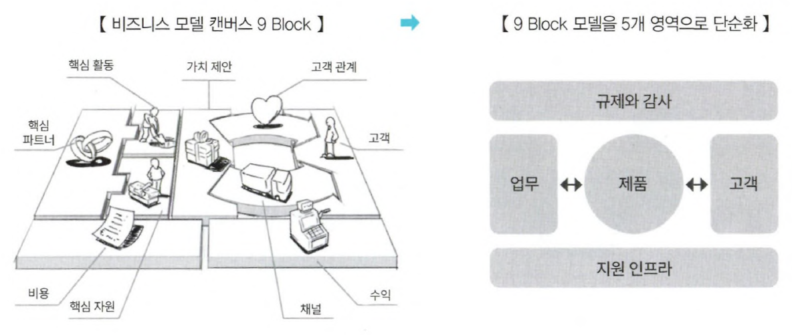
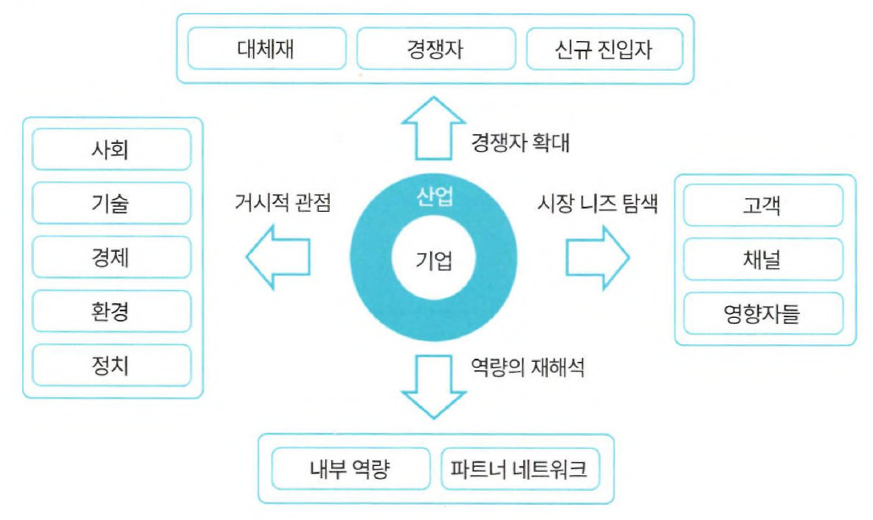
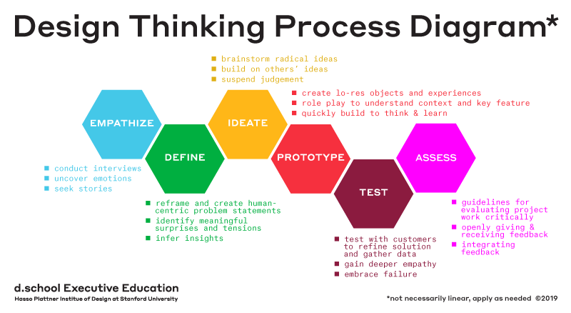

# 분석 과제 발굴

- 분석 과제 : 풀어야 할 다양한 문제를 데이터 분석 문제로 변환 후, 관계자들이 이해할 수 있는 프로젝트 수행 목적의 **과제 정의서 형태로 도출**된 것
- 분석 과제 도출은 <strong>"하향식 접근법(Top-Down Approach)"</strong>와 <strong>"상향식 접근법(Bottom-Up Approach)"</strong>으로 나뉜다.

|방법 ＼ 대상|Known                                         |Unknown                                    |
|:-----------|:--------------------------------------------:|:-----------------------------------------:|
|Known       |최적화 Optimization                        |통찰력 Insight                          |
|Unknown     |해결책 Solution                            |발견 Discovery                          |
|접근 방법   |Top-Down Approach (Optimization → Solution)|Bottom-Up Approach (Discovery → Insight)|

- **하향식 접근법(Top-Down Approach)**
    - 문제가 주어졌을 때, 해결해야 할 과제가 무엇인지 찾는 전통적인 Top-Down 수행 방식
    - 각 과정이 체계적으로 단계화되어 문제를 해결하는 방식
- **상향식 접근법(Bottom-Up Approach)**
    - 대규모 데이터가 생성되고 변화하는 현대에서는 문제가 무엇인지 사전 정의가 어려움
    - 다양한 데이터 조합 속에서 인사이트를 찾아내는 Bottom-Up 방식
- 실제 분석 과정에서는 두 방법이 혼용되어 사용되며, **최적의 의사결정은 두 접근 방식이 상호 보완 관계**에 있을 때 가능하다.

## 디자인 씽킹 (Design Thinking)

- 상향식 접근법의 발산 단계와 하향식 접근법의 수렴단계를 반복적으로 수행하여 상호 보완적으로 분석 가치를 높이는 의사결정 방식

# 하향식 접근법(Top-Down Approach)

- 분석 대상이 무엇인지 알고 있을 경우 활용 가능한 방식
- 현황 분석을 통해 기회나 문제를 탐색하고, 문제를 정의, 해결 방안을 탐색, 데이터 분석의 타당성 평가를 거쳐 **분석 과제를 도출**하는 과정으로 구성

- 하향식 접근법 기획 단계
    1. 문제 탐색 단계 
        ① 비즈니스 모델 탐색 기법 
        ② 분석기회 발굴 및 범위 확장 
        ③ 외부 참조 모델 기반 문제 탐색 
        ④ 분석 유즈케이스
    2. 문제 정의 단계
    3. 해결 방안 탐색 단계
    4. 타당성 검토 단계

## 문제 탐색 단계 (Problem Discovery)

- 전체적인 관점의 기준 모델을 활용해 빠짐없이 문제를 도출하고 식별하는 것이 중요
    - 기업 내·외부 환경을 포괄하는 비즈니스 모델과 외부 참조 모델 전부 활용
- 세부적인 구현 및 솔루션에 초점을 맞추는게 아니라, **문제를 해결**함으로써 **발생하는 가치에 중점**을 두는 것이 중요

### 비즈니스 모델 탐색 기법

- 비즈니스 모델 캔버스의 9가지 블록을 5가지로 단순화한 탐색 기법
- **업무(Operation), 제품(Product), 고객(Customer)** 단위로 문제를 발굴하고, 이를 관리하는 **규제와 감사(Regulation & Audit), 지원 인프라(IT & Human Resource)** 영역에 대한 기회를 추가로 도출하는 작업 수행

| 5가지 영역                       | 내용                                                                                     | 예시                                                                               |
| :------------------------------: | :--------------------------------------------------------------------------------------- | :--------------------------------------------------------------------------------- |
|업무 Operation                 |제품 및 서비스 생산을 위해 운영하는 **내부 프로세스 및 주요자원(Resource)** 관련 주제 도출| - 생산 공정 최적화  - 재고량 최소화                                             |
|제품 Product                   |생산 및 제공하는 **제품·서비스**를 개선하기 위한 관련 주제 도출                           | - 제품의 주요기능 개선  - 서비스 모니터링 지표도출                              |
|고객 Customer                  |제품·서비스를 제공받는 사용자 및 고객, 이를 **제공하는 채벌의 관점**에서 관련 주제 도출   | - 고객 Call 대기 시간 최소화  - 영업점 위치 최적화                              |
|규제와 감사 Regulation & Audit |제품 생산 및 전달과정 프로세스 중에서 발생하는 **규제 및 보안의 관점**에서 주제 도출      | - 제공 서비스 품질의 이상 징후 관리  - 새로운 환경 규제 시 예상되는 제품 추출 등|
|지원 인프라 IT & Human Resource|분석을 수행하는 시스템 영역 및 이를 운영·관리하는 **인력의 관점**에서 주제 도출           | - EDW 최적화  - 적정 운영 인력 도출 등                                          |

### 분석기회 발굴 및 범위 확장

#### 거시적 관점

- 조직 및 해당 산업에 폭넓게 영향을 미치는 사회·경제적 요인을 STEEP으로 요약되는 영역으로 폭넓게 나눔
    - STEEP : Social(사회), Technological(기술), Economic(경제), Environmental(환경), Political(정치)

| 영역                | 내용                                                                                             | 예시                                                    |
| :-----------------: | :----------------------------------------------------------------------------------------------- | :------------------------------------------------------ |
|Social 사회       |고객을 전체 시장 대상으로 확장하여, **사회적, 문화적, 구조적 트랜드 변화에 기반한 분석 기회 도출**| - 밀레니엄 세대 등장  - 노령화 문제  - 저출산 문제|
|Technological 기술|**변화에 따른 역량 내 재화와 제품·서비스 개발**에 대한 분석 기회 도출                             | - 나노 기술  - IT 융합 기술  - 로봇 기술 고도화   |
|Economic 경제     |**산업·금융 전반의 변동성 및 경제 구조 변화 동향**에 따른 시장 흐름 파악 후 분석 기회 도출        | - 원자재 가격  - 환율  - 금리 변동                |
|Environmental 환경|**환경과 관련된 정부, 사회단체, 시민사회의 관심과 규제 동향**을 파악하고 분석 기회 도출           | - 탄소 배출 규제  - 탄소 거래 시장 등장              |
|Political 정치    |**주요 정책방향, 정세, 지정학적 동향** 등 거시적 흐름을 토대로 한 분석 기회 도출                  | - 대북 관계                                             |

#### 경쟁자 확대 관점

- 현재 사업 영역의 직접 경쟁사 및 제품·서비스 뿐만 아니라, 대체재와 신규 진입자 등으로 관점 확대하여 위협 가능한 상황에 대한 분석 기회 발굴 폭을 넓혀서 탐색
- **대체재 (Substitute)**
    - 기업의 상품 및 서비스가 대체될 수 있는 것에 대한 탐색 및 잠재적 위협 파악
    - 오프라인 서비스 → 온라인 제공에 대한 탐색 및 잠재적 위협 파악
- **경쟁자 (Competitor)**
    - 주요 경쟁자에 대한 동향을 파악하여 이를 고려한 분석 기회 도출
    - 식별된 주요 경쟁사의 제품 및 서비스 카탈로그 및 전략을 분석
- **신규 진입자 (New Entrant)**
    - 향후 영향력이 커질 것으로 파악되는 신규 진입자 동향을 파악 후 분석 기회 도출

#### 시장의 니즈 탐색

- **고객 (Customer)**
    - 고객 구매 동향 및 산업, 경영 현황 등을 파악하고 이해하여 제품·서비스 개선에 필요한 분석 기회 도출
- **채널 (Channel)**
    - 상품 및 서비스가 제공, 전달되는 경로에 대해 파악하여 분석 기회 도출
- **영향자 (Influencer)**
    - 시장 확대에 따른 유사 업종의 기업 인수 등, 주주·투자자·협회 및 기타 이해 관계자의 주요 관심사항에 대해 파악 후 분석 기회 탐색

#### 역량의 재해석

- **내부 역량 (Competency)**
    - 지적 재산권, 기술력 등 노하우와 인프라적 유형 자산에 대해 재해석하고 분석 기회 탐색
    - 자사 소유 부동산 등 활용
- **파트너와 네트워크 (Partners & Network)**
    - 자사가 직접 보유하진 않지만, 관계사와 공급사의 역량을 활용해 수행 가능한 기능 파악 후 분석 기회 도출
    - 기업 경영 노하우, 수출입·통관 등을 활용한 추가 사업기회 탐색

### 외부 참조 모델 기반 문제 탐색

- 유사·동종 사례 벤치마킹을 통한 분석기회 발굴은 산업별·서비스별 **분석 테마 후보 그룹(POOL)**을 통해 가장 빠르고 쉬운 방식(Quick&Easy)으로 분석 기회가 무엇인지 아이디어를 얻는 브레인스토밍 방식이다.
- 데이터 분석을 통한 인사이트, 업무에 활용하는 사례 발굴, 자사 서비스에 적용하며 지속적인 조사 및 가치 발굴 사례 등을 풀(POOL)로 정리해둔다면 과제 발굴 및 탐색 시 빠르고 의미 있는 분석 기회 도출이 가능하다.

### 분석 유즈케이스

- 현재 비즈니스 모델 및 유사·동종 사례 탐색을 통해 발견된 문제들을 구체적인 세부과제로 만들기 전, 분석 유즈케이스(Analytics Use Cases)로 정의한다.
    - 분석 유즈케이스(Analytics Use Cases) : 분석을 적용했을 때 업무 흐름을 개념적으로 설명한 것
- 분석 유즈케이스(Analytics Use Cases)와 풀어야 할 문제에 대한 상세한 설명 및 해당 문제 해결 시 발생하는 효과를 함께 명시한다.
- 향후 데이터 분석 문제로의 전환 및 적합성 평가에 활용되도록 한다.

## 문제 정의 단계 (Problem Definition)

- 식별된 **비즈니스 문제를 데이터 문제로 변환**하여 정의하는 단계
- 문제 탐색 단계가 무엇을(What) 어떤 목적으로(Why) 수행해야 하는지 관점이라면, 해당 단계는 필요한 데이터 및 기법(How)를 정의하는 단계
- **데이터 분석 문제의 정의**는 효용을 얻을 수 있는 **최종 사용자(End User)** 관점에서 이루어져야한다.
- 데이터 분석 문제가 잘 정의되어야 필요한 데이터 정의 및 기법 발굴이 용이하므로, **정확하게 분석의 관점으로 문제를 재정의**할 필요가 있다.
- **예시** : "고객 이탈의 증대" (비즈니스 문제) → "고객 이탈에 영향을 미치는 요인 식별 & 이탈 가능성 예측" (데이터 문제)

## 해결 방안 탐색 단계 (Solution Search)

- 정의된 **데이터 분석 문제를 해결**하기 위한 다양한 방안이 모색됨
- 동시에 현재 기업 수준에서 분석 가능한 시스템을 갖추었는지, 수행 가능한 인력 확보가 되었는지 함께 확인 필요
- 불가하다면, 교육이나 전문인력 채용을 통한 역량 확보, 혹은 분석 전문업체를 활용하여 **과제를 해결하는 방안에 대해 사전 검토** 수행

| 기법 및 시스템(How) ＼ 분석역량(Who) | 확보                                         | 미확보                                    |
|:-------------------------------------|:--------------------------------------------:|:-----------------------------------------:|
| 기존 시스템                          | 기존 시스템 개선 활용                        | 교육 및 채용을 통한 역량확보              |
| 신규 도입                            | 시스템 고도화                                | 전문업체 Sourcing                         |

## 타당성 검토 단계 (Feasibility Study)

- 분석 과제 정의가 되었는지, 어떤 방법으로, 어떤 인력과 함께 수행할지 결정되었다면, 해결 방안이 타당한지 검증 필요
- 크게 경제적 타당성 검토와 데이터 및 기술적 타당성 검토 2가지로 나뉜다.

### 경제적 타당성

- **비용대비 편익 분석 관점**의 접근이 필요
- 데이터, 시스템, 인력, 유지보수 등과 같은 비용과 분석 결과를 적용했을 때 추정되는 실질적 비용 절감, 추가 매출, 수익 등과 같은 경제적 가치를 함께 고려해야함

### 데이터 및 기술적 타당성

- 데이터 존재 여부, 분석 시스템 환경, 분석 역량이 필요 → 실현 가능성을 확인
    - 분석 역량의 경우, 실제 프로젝트 수행 시 걸림돌이 되는 경우가 많음
    - 역량 확보 방안을 사전에 수립하고, 효과적 평가를 위한 비즈니스 지식과 기술적 지식 필요

# 상향식 접근법(Bottom-Up Approach)

- 분석 대상이 무엇인지 모를 경우 분석 과제 발굴을 위해 사용하는 방법
- 원천 **데이터로부터 통찰과 지식**을 얻는 방법
- 하향식은 계획 수립 후 분석 단계로 이어지지만, 상향식은 분석 먼저 하고 가치 있는 문제를 도출한다.

## 스탠퍼드대학 d.school의 디자인 씽킹(Design Thinking)

- 대표적인 상향식 접근법 중 하나
- "답을 미리 내는 것이 아니라, 사물을 있는 그대로 인식하는 "What" 관점에서 보아야 한다"
- 객관적으로 존재하는 데이터 그 자체를 관찰하고, 실제적으로 행동에 옮김으로써 대상을 좀 더 잘 이해하는 방식으로 접근을 수행 → 첫번째 단계, Empathize를 강조

- 프로세스
    1. 공감 (Empathize)
    2. 문제 정의 (Define)
    3. 아이디어 도출 (Ideate)
    4. 프로토타입 (Prototype)
    5. 테스트 (Test)
    6. 평가 (Assess)

## 비지도학습

- 일반적인 **상향식 접근 방식**의 데이터 분석이 취하는 방법
- 정답을 알려주지 않고 학습하는 것
- Label이 없는 데이터를 비슷한 특징을 가진 데이터끼리 군집화하여 새로운 데이터에 대한 결과를 예측하는 것
- 데이터 자체의 결합, 연관성, 유사성 등을 중심으로 데이터의 상태를 표현하는 것
- 예시) 장바구니 분석, 기술통계, 프로파일링, 군집 분석, 주성분분석, 다차원 척도 등

## 지도학습

- 정답이 있는 데이터를 활용하여 분석 모델을 학습시키는 것
- **명확한 목적 하에 데이터 분석을 실시**할 때 사용하는 방법
- **도출되는 값에 대해 사전에 인지**하고, 입력에 따른 출력을 예측하는 것
- 분류, 추측, 예측, 최적화를 통해 사용자 주도하에 분석을 실시하고 지식을 도출
- Label이 범주형인 경우 **분류**, 연속형인 경우 **회귀**

## 시행착오를 통한 문제 해결(프로토타이핑 접근법)

- 상향식 접근법 중 한가지 방법
- 일단 분석을 시도하고 결과를 확인해가며 **반복적으로 개선해나가는 방법**
- 완전하진 못하지만, 신속하게 해결칙이나 모형을 제시함으로써, 문제를 좀 더 명확히 인식하고 필요한 데이터를 식별하여 구체화할 수 있는 유용한 접근 방식
    - 반면, 하향식은 문제가 정형화 되어 있고 문제해결을 위한 데이터가 완벽히 존재할 경우 효과적

### 프로세스

1. 가설 생성
2. 디자인에 대한 실험
3. 실제 환경에서 테스트
4. 결과로부터 인사이트 도출 및 가설 확인

위와 같은 과정이 반복된다.

### 프로토타이핑 접근법이 필요한 상황

- 문제에 대한 인식 수준이 낮거나 **불명확**할 경우
    - **문제 정의가 불명확**하거나 새로운 문제일 경우, 프로토타입을 통해 이해도를 높이며 구체화하는 도움을 받을 수 있음
- 필요 데이터 존재가 불확실한 경우
    - 데이터가 명확히 존재하지 않을 때, 어떻게 수집할 것인지, 다른 것으로 대체할 것인지 등 **사용자와 분석가 간 반복적이고 순환적인 협의 과정**이 필요
    - 대체 불가능한 데이터가 존재하는지 사전에 확인한다면 불가능한 프로젝트 수행 리스크를 사전에 방지 가능
- 데이터 사용 목적이 가변적일 경우
    - 데이터 가치는 지속적으로 변화 가능하여, **기존의 데이터 정의를 재검토하여 데이터 사용 목적과 범위를 확대** 할 수 있음

# 분석 과제 정의서

- 분석별로 필요한 소스 데이터, 분석 방법, 데이터 입수 및 분석 난이도, 분석 수행주기, 분석 결과에 대한 검증 오너십, 상세 분석 과정 등 정의 필요
- 분석 데이터 소스는 내외부의 비구조적인 데이터와 소셜 미디어 및 오픈 데이터까지 범위를 확장하여 고려하고, 분석방법 또한 상세히 정의