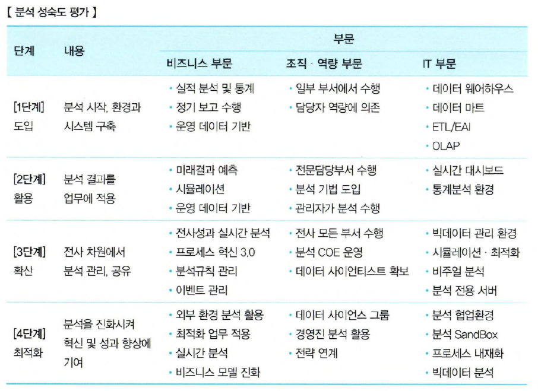

# 분석 거버넌스 체계

- 거버넌스 : 기업에서 의사결정을 위한 데이터의 분석과 활용을 위한 체계적인 관리를 의미
- 대용량 데이터 수집·축적보다 어떤 목적으로 어떤 분석을 수행하고 활용할 것인지가 중요
- 데이터 분석을 기업 내 문화로 정착하고 지속적으로 고도화하기 위해서 필요

## 구성 요소

- Organization : 분석 기획 및 관리를 수행하는 조직
- Process : 과제 기획 및 운영 프로세스
- System : 분석 관련 시스템
- Data : 데이터
- Human Resource : 분석 관련 교육 및 마인드 육성 체계

# 데이터 분석 수준 진단

- 기업은 도입 여부와 활용 여부에 대해 명확한 분석 수준 점검이 필요
- 분석 준비도와 분석 성숙도를 통해 분석 수준 진단하고, 분석 유형 및 방향성 결정 가능

## 분석 준비도

- 기업의 데이터 분석 도입 수준을 파악하기 위한 진단 방법

### 구성 요소

- 분석 업무 파악
    - 발생한 사실 분석 업무
    - 예측 분석 업무
    - 시뮬레이션 분석 업무
    - 최적화 분석 업무
    - 분석 업무 정기적 개선
- 분석 인력 및 조직
    - 분석 전문가 직무 존재
    - 분석 전문가 교육 훈련 프로그램
    - 관리자들의 기본 분석 능력
    - 전사 분석 업무 총괄 조직 존재
    - 경영진의 분석 업무 이해 능력
- 분석 기법
    - 업무별 적합한 분석기법 사용
    - 분석 업무 도입 방법론
    - 분석 기법 라이브러리
    - 분석 기법 효과성 평가
    - 분석 기법 정기적 개선
- 분석 데이터
    - 분석 업무를 위한 데이터 충분성/신뢰성/적시성
    - 비구조적 데이터 관리
    - 외부 데이터 활용 체계
    - 기준 데이터 관리(MDM)
- 분석 문화
    - 사실에 근거한 의사결정
    - 관리자의 데이터 중시 정도
    - 회의 등에서 데이터 활용 상황
    - 경영진의 직관보다 데이터 기반 의사 결정
    - 데이터 공유 및 협업 문화
- IT 인프라
    - 운영시스템 데이터 통합
    - EAI, ETL 등 데이터 유통 체계
    - 분석 전용 서버 및 스토리지
    - 빅데이터 분석 환경
    - 통계 분석 환경
    - 비쥬얼 분석 환경

### 진단 과정

1. 영역별로 세부 항목에 대한 수준파악
2. 진단 결과 전체 요건 중 일정 수준이상 충족하면 분석업무 도입
3. 충족하지 못할 시 분석 환경 조성

## 분석 성숙도

### 능력 성숙도 통합 모델 (CMMI, Capability Maturity Model Integration)

- 소프트웨어 개발 및 전산장비 운영 업체들의 업무 능력 및 조직의 성숙도를 평가하기 위한 모델
- 아래와 같은 5가지 단계로 나눠서 역량을 평가한다.
    1. 개인의 역량이 프로젝트의 성공과 실패를 나누는 주요 요인으로 프로젝트의 개발 프로세스가 거의 없다.
    2. 일정이나 비용과 같은 요소가 프로세스의 중심으로, 약간의 개발 프로세스 하에서 통제되는 상태다.
    3. 2단계에서 존재하지 않는, 조직을 관리하기 위한 프로세스가 존재하는 상태다.
    4. 체계적인 관리 하에 프로젝트 및 산출물 등에 대한 정량적인 측정이 가능한 상태다.
    5. 조직적으로 최적화된 프로세스를 보유하고 지속적인 개선을 목표로 하는 상태다.

### 성숙도 수준 분류

- 도입 → 활용 → 확산 → 최적화

### 분석 성숙도 진단 분류

- 비즈니스 부문, 조직역량 부문, IT 부문

<!-- 마크다운 표로 정리가 어려워서 스샷으로 정리 -->

## 분석 수준 진단 결과

- 기업의 현재 분석 수준을 객관적으로 파악
- 분석 관점에서 사분면으로 구분

| 성숙도 ＼ 준비도 | 낮음   | 높음   |
| :--------------- | :----: | :----: |
| 높음             | 정착형 | 확산형 |
| 낮음             | 준비형 | 도입형 |

### 준비형

- 낮은 준비도, 낮은 성숙도
- 분석을 위한 데이터, 인력, 조직, 업무, 분석 기법 등이 적용되지 않으므로 사전 준비가 필요

### 정착형

- 낮은 준비도, 높은 성숙도
- 조직, 인력, 분석, 업무, 분석 기법 등을 기업 내부에서 제한적으로 사용 중
- 우선적으로 정착이 필요한 기업

### 도입형

- 높은 준비도, 낮은 성숙도
- 분석 업무 및 분석 기법은 부족
- 적용조직 등 준비도가 높아 데이터 분석을 바로 도입할 수 있음

### 확산형

- 높은 준비도, 높은 성숙도
- 기업에 필요한 6가지 분석 구성요소를 갖춤
- 부분적으로 도입되어 지속적인 확산이 필요한 기업

# 분석 지원 인프라 방안 수립

- 분석 과제 단위별 별도의 분석시스템 구축 시, 관리의 복잡도 및 비용의 증대라는 부작용 발생
- 분석 마스터 플랜 기획 단계에서 장기적이고 안정적으로 활용 가능한 확장성을 고려한 플랫폼 구조 도입이 적절

### 개별 시스템

- 시스템 간 자체적인 데이터 교환
- 시스템별 독립적인 데이터 관리
- 확장 시 시스템 간 인터페이스 폭증

### 플랫폼 구조

- 분석 플랫폼을 활용한 공동기능 활용
- 중앙집중적 데이터 관리
- 시스템 간 인터페이스 최소화

# 데이터 거버넌스 체계 수립

- 전사 차원의 모든 데이터에 대해 정책 및 지침, 표준화, 운영 조직 및 책임 등의 표준화된 관리 체계를 수립하고 운영을 위한 프레임워크 및 저장소를 구축하는 것
- 한국데이터산업진흥원 : 기업에서 보유하고 있는 데이터의 관리 정책, 지침, 표준, 전략 및 방향을 수립하고, 데이터를 관리할 수 있는 조직 및 서비스를 구축하는 정책과 프로세스 관점에서의 IT 관리 체계
- 마스터 데이터, 메타데이터, 데이터 사전 등은 중요한 관리 대상

## 구성 요소

- 원칙 (Principle)
    - 데이터를 유지 관리하기 위한 지침과 가이드
    - 보안, 품질 기준, 변경 관리
- 조직 (Organization)
    - 데이터를 관리할 조직의 역할과 책임
    - 데이터 관리자, 데이터베이스 관리자, 데이터 아키텍트
- 프로세스 (Process)
    - 데이터 관리를 위한 활동 체계
    - 작업 절차, 모니터링 활동, 측정 활동

## 데이터 거버넌스 체계

### 데이터 표준화

- 데이터 표준 용어 설정, 명명 규칙(Name Rule) 수립, 메타 데이터(Meta Data) 구축, 데이터 사전(Data Dictionary) 구축 등의 업무로 구성
    - 데이터 표준 용어 : 관용화된 용어를 사용하여 사용자 간 의사소통을 명확히 함
        - 표준 단어사전, 표준 도메인사전, 표준 코드 등으로 구성
        - 사전에 상호 검증이 가능하도록 점검 프로세스를 포함해야 함
    - 명명 규칙 : 필요시 언어별(한글, 영어 등)로 작성되어 매핑 상태 유지
    - 데이터 사전 구축 : 관리될 모든 데이터에 대한 명명 규칙 수립의 연장된 작업

### 데이터 관리 체계

- 데이터 정합성 및 활용의 효율성을 위해, 표준 데이터를 포함한 메타데이터와 데이터 사전의 관리 원칙 수립
- 수립된 원칙에 근거하여 항목별 상세 프로세스를 만들고, 관리와 운영을 위한 담당자 및 조직별 역할과 책임을 상세히 준비
- 빅데이터의 경우, 데이터 양 급증으로 데이터 생명 주기 관리 방안을 수립하지 않으면 데이터 가용성 및 관리 비용 증대 문제에 직면할 수 있음
    - 데이터 생명주기 관리 방안 : 오래된 데이터 보관 시 관리 비용이 데이터 가치보다 클 수 있어, 주기가 만료된 데이터는 폐기하도록 관리

### 데이터 저장소 관리 (Repository)

- 메타 데이터 및 표준 데이터를 관리하기 위한 전사 차원의 저장소 구성
- 데이터 관리 체계 지원을 위한 워크플로우 및 관리용 응용 소프트웨어를 지원
- 관리 대상 시스템과의 인터페이스를 통한 통제
- 데이터 구조 변경에 따른 사전 영향 평가도 수행되어야 효율적 활용 가능

### 표준화 활동

- 데이터 거버넌스 체계 구축 후 표준 준수 여부를 주기적으로 점검하고 모니터링 실시
- 거버넌스의 조직 내 안정적 정착을 위한 지속적인 변화 관리 및 주기적 교육 진행
- 지속적인 데이터 표준화 개선 활동을 통해 실용성을 높여야 함

# 데이터 조직 및 인력방안 수립

## 데이터 분석 조직

- 기업 내 존재하는 빅데이터 속에서 가치를 찾아 전파하고, 행동화하는 역할
- 분석에 대한 지식과 경험을 가지고 있는 인력으로 구성

### 목표

- 기업의 경쟁력 확보를 위한 비즈니스 질문(Question)과 부합하는 가치(Value)를 찾고 비즈니스를 최적화(Optimization)하는 것

### 역할

- 전사 및 부서의 분석 업무를 발굴하고 전문적 기법과 분석 도구를 활용하여 기업 내 존재하는 빅데이터 속에서 인사이트를 전파하고 이를 행동화하는 것

### 구성

- 기초 통계학 및 분석 방법에 대한 지식과 분석 경험을 보유하고 있는 인력으로 전사 또는 부서 내 조직으로 구성하여 운영

## 조직 및 인력 구성 시 고려사항

### 조직 구조

- 비즈니스 질문을 선제적으로 찾아낼 수 있는 구조인가?
- 분석 전담조직과 타 부서 간 유기적인 협조와 지원이 원활한 구조인가?
- 효율적인 분석 업무를 수행하기 위한 분석 조직의 내부 조직 구조는?
- 전사 및 단위부서가 필요할 경우 접촉하며 지원할 수 있는 구조인가?
- 어떤 형태의 조직으로 구성하는 것이 효율적인가?

### 인력 구성

- 비즈니스 및 IT전문가의 조합으로 구성되어야 하는가?
- 어떤 경험과 스킬을 갖춘 사람으로 구성해야 하는가?
- 통계적 기법 및 분석 모델링 전문 인력을 별도로 구성해야 하는가?
- 전사 비즈니스를 커버하는 인력이 없다. 그렇다면?
- 전사 분석 업무에 대한 적합한 인력 규모는 어느 정도인가?

## 데이터 분석 조직 유형

### 집중형 조직 구조

- 전사 분석 업무를 별도의 분석 전담 조직에서 담당
- 전략적 중요도에 따라 우선순위를 정해서 추진 가능
- 단점
    - 현업 업무 부서의 분석 업무와 이중화/이원화 가능성 있음

### 기능 중심의 조직 구조

- 일반적인 분석 수행 구조
- 별도의 분석 조직이 없고, 해당 업무 부서에서 직접 분석 수행
- 단점
    - 전사적 핵심분석이 어려움
    - 과거 실적 혹은 특정 업무 부서에 국한된 분석 수행 가능성 높음
    - 일부 중복된 분석 업무를 수행할 수 있음

### 분산형 조직 구조

- 분석 조직의 인력들을 현업 부서에 배치해 분석을 수행
- 전사 차원에서 우선순위 선정해 수행 가능
- 분석 결과를 신속하게 실무에 적용 가능
- 분석 결과를 공유 가능
- 단점
    - 부서 분석업무와 역할 분담이 명확해야함

### 분석 조직 인력 구성

- 비즈니스 인력 : 해당 비즈니스를 잘 이해하고, 분석 요소를 찾고 협의할 수 있는 인력
- IT 기술 인력 : 분석에 필요한 IT 기술 동향을 파악, 필요한 기술 아키텍처를 수립할 수 있는 인력
- 분석 전문 인력 : 고급 통계 분석 기법을 이해하고 다양한 예측 모델링을 설계/검증할 수 있는 인력
- 변화 관리 인력 : 경영층 대상으로 분석문화 확산을 위한 변화관리를 담당하는 인력
- 교육 담당 인력 : 분석조직에게 다양한 분석 기법에 대한 심도있는 교육을 할 수 있는 인력

# 분석 과제 관리 프로세스 수립

- 분석 마스터 플랜이 수립되고, 초기 데이터 분석 과제가 성공적으로 수행된다면, 지속적인 분석 니즈 및 기회가 분석 과제 형태로 도출될 수 있음
- 이를 체계적으로 관리하기 위한 프로세스가 요구되고, 프로세스를 수행함으로써 기업 내 분석 문화를 내재화할 수 있음

## 과제 관리 프로세스

- 과제 발굴 : 개별 조직이나 개인이 도출한 분석 아이디어를 발굴하고 과제화하여 POOL(사용 가능한 데이터의 집합)로 관리하면서 분석 프로젝트를 선정하는 작업 수행
- 과제 수행 : 분석을 수행할 팀을 구성하고 분석 과제 수행 시 지속적인 모니터링과 결과 공유 및 개선하는 절차 수행

1. 분석 Idea 발굴
2. 분석 과제 후보 제안
    - 과제 후보 Pool 생성
3. 분석 과제 확정
    - 전사분석조직에서 과제 제안
4. 팀 구성
    - 과제 추진팀 구성
5. 분석 과제 실행
    - 전사분석조직에서 과제 추진팀에 수행 지원
6. 분석 과제 진행 관리
7. 결과 공유/개선
    - 과제 결과 Pool 생성

- 지속적이고 체계적인 분석 관리 프로세스를 수행함으로써 조직 내 분석 문화 내재화 및 경쟁력 확보
- 과제 진행하며 만들어진 시사점을 포함한 결과물을 Pool에 축적하고 관리함으로써, 향후 유사한 분석과제 수행 시 시행착오 최소화 및 효율적 진행 가능

# 분석 교육 및 변화 관리

- 빅데이터 등장으로 인한 비즈니스 영역의 변화에 대응하기 위해, 기업은 적합한 분석 업무 도출과 가치를 높여줄 수 있도록 분석 조직 및 인력에 지속적인 교육과 훈련이 실시되어야 한다.
- 경영층이 사실 기반 의사 결정을 할 수 있는 문화를 정착시키려는 변화 관리를 지속적으로 계획하고 수행해야 한다.

## 분석 도입에 대한 문화적 대응

- 초기에는 기존 행태로 되돌아가는 관성이 존재하므로, 안정적인 추진기로 접어들기까지 적극적인 변화 관리가 필요하다.

1. 준비기
    - 분석 중심 문화가 미도입된 현재의 상태
    - 막연한 불안감 존재
2. 분석 내재화 단계
    - 기존 행태로 되돌아가려는 경향 존재
    - 성공 시 강한 탄성에 의한 변화 가속화
3. 안정 추진기
    - 분석 활용이 일상화된 균형 상태

### 빅데이터 시대 변화에 적극적인 대응방법

- 기업에 맞는 적합한 분석 업무의 수행
- 분석 조직 및 인력에 대한 지속적인 교육과 훈련 실시
- 경영층이 사실 기반 의사결정을 할 수 있는 문화 정착
- 지속적인 변화관리 계획
- 수행·업무 수행자에 대한 분석기회 발굴, 구체화, 시나리오 작성법 등

## 분석 교육

- 단순한 툴 교육이 아닌, 분석 역량 확보 및 강화에 초점을 맞춰서 진행
    - 분석 기획자 : 데이터 분석 큐레이션 교육
    - 분석 실무자 : 데이터 분석 기법 및 툴에 대한 교육
    - 업무 수행자 : 분석기회 발굴, 구체화, 시나리오 작성법 등
- 다양한 교육을 통해 조직 구성원 모두에게 분석 기반의 업무 정착 필요
- 나아가 데이터를 바라보는 관점, 데이터 분석과 활용 등이 기업 문화로 자연스럽게 확대되어야 함